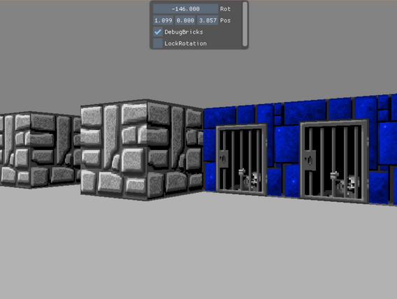

# Exercise 6

For you exercise to be evaluated, it must be able to be run following these steps:
- Drag and drop the submission folder inside SimpleRenderEngineProject
- Add submission folder as subdirectory in `SimpleRenderEngineProject/CMakeLists.txt`
Please check that this is possible before submission, if not we will notify you.

## 6.1
Implement the camera movement
- the camera should rotate with A/D or with the mouse movement left and light
- the camera should move forward and backward with W/S, keeping in mind the camera rotation

If you are using the provided code, you will need to complete `ComponentController::Update()` and `ComponentController::KeyEvent()`.
There is also a UI component that will show you the camera position and rotation, which you can change at runtime to test stuff.

## 6.2
Create a procedural cube
- create a face of size 1, centered around the origin, looking at the camera
- assign UV coordinates to the vertices to show one of the wall tiles in `data/level0.png`
- create 3 additional faces to generate a cube without top or bottom

If you are using the provided code, you will need to complete `ComponentRendererMesh::Init()`.

## 6.3
Level layout
- create a new component for handling the level layout. The component should have the following serialized data
	- an array of array of integers `layout` (0 should be the first tile in the `data/level0.png`, 1 the second, and so on)
	- (optional) a size
- on init, the component should
	- create a new gameObject with a `ComponentRenderMesh` for each entry in `layout`
	- assign different UV coordinates to the cube, so that each face shows one of the tiles in the texture
	- set the position of the child gameObjects to replicate the structure in 3D space